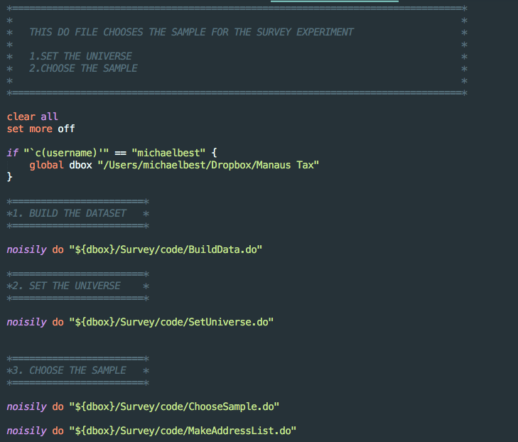

# WORKFLOW

## Tasks

### Folder Organization

#### Assignment Folders Dropbox vs Github

The difference between Github and Dropbox will become clearer after section 10 Github, but we should note a few things beforehand. The two are fundamentally different in their purposes: Dropbox is great at storing huge amounts of data in the cloud, while Github excels at storing multiple versions of your code. In practice, this means that you will have a Dropbox folder with all your data and one Github folder with all your codes. Your plots, pictures, and tables can go in either.

#### Make Files

Each folder should have a “main” file that calls the other scripts/functions from the folder. A folder can quickly grow into having multiple files, and the master file should help one to figure out the connections between them, e.g., in what order each file should be called. An example in Stata:

#### Example Directory

Beyond the “master code” already mentioned, ideally, a code directory would contain a “ReadMe.pdf” that describes briefly the codes and their connection, as well as the conclusions met and the main evidence found. Even though Github stores all the versions of our code, it is useful to keep at least the last version of the code in an “Archive” folder, to avoid going through the different versions of Git. If you use generic auxiliary functions in many of your codes, they should go in an “AuxFunctions” folder. The following picture illustrates an example directory:

## Project Manual

## Version Control
